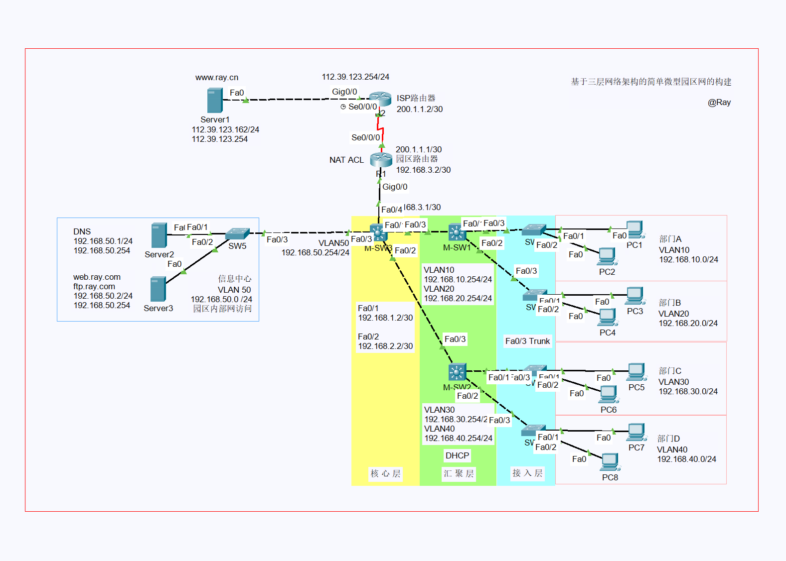
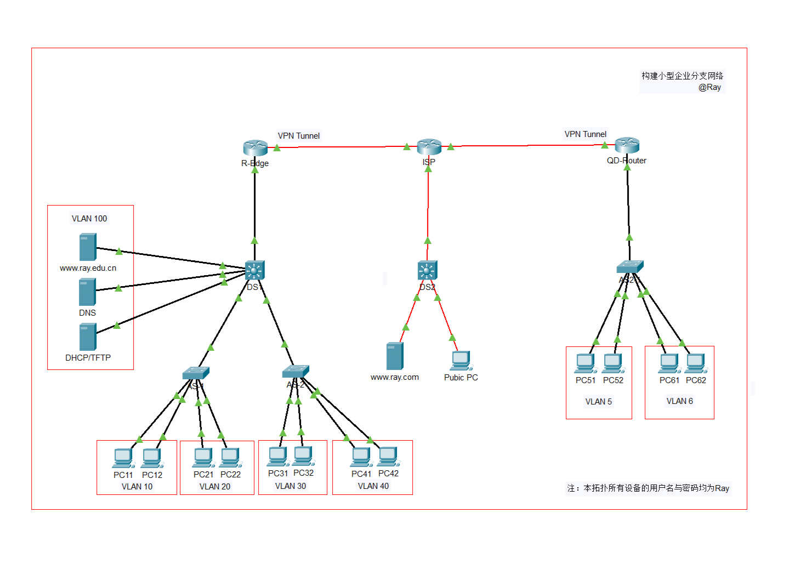
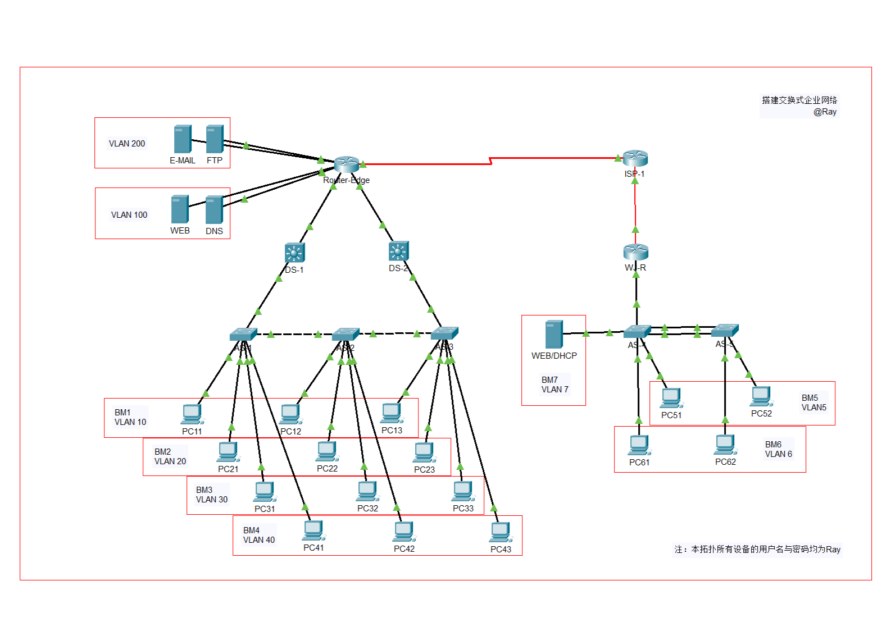

# [cpt-projects](https://github.com/Zenhwei/cpt-projects)

Network simulation projects based on Cisco Packet Tracer, featuring enterprise network architecture, routing protocols, security policies, redundancy design, along with corresponding configurations and test validations.

The network topology files and documents of this project are licensed under the Creative Commons Attribution 4.0 International License ([**CC BY 4.0**](https://creativecommons.org/licenses/by/4.0/)).

*There are currently 3 projects in the collection.*

## [1. simple micro campus network](https://github.com/Zenhwei/cpt-projects/tree/main/simple_micro_campus_network)

Construction of a Simple Micro Campus Network Based on a Three-Tier Architecture, featuring broadcast domain isolation, inter-VLAN routing, DHCP services, end-to-end connectivity verification, RIP routing, NAT, ACLs, DNS, Web, and FTP services.

## [2. small business branch network](https://github.com/Zenhwei/cpt-projects/tree/main/small_business_branch_network)

Build a small enterprise branch network featuring directly connected routes, static routing, RIPv2, route redistribution, and router-on-a-stick; VLANs, Trunking, and SVIs; privileged password, password encryption, Telnet, and SSH; web services, DNS, DHCP, and TFTP; NAT and GRE VPN.

## [3. switched enterprise network](https://github.com/Zenhwei/cpt-projects/tree/main/switched_enterprise_network)

The project primarily implements a switched enterprise network featuring directly connected routing, static routing, and router-on-a-stick configurations, along with VLANs, Trunking, HSRP, STP, VTP, and SVIs. It also includes privileged password protection, Telnet access, configuration file backup, DHCP services, and ACLs, as well as integrated WEB, DNS, DHCP, and FTP servers. Additionally, the design incorporates NAT, PPP, and GRE VPN functionalities.

